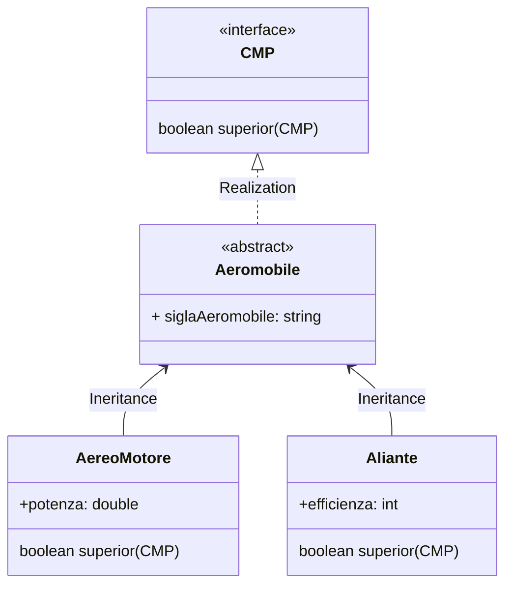

# Esercizio Aeromobile

```mermaid
classDiagram
class CMP 
<<interface>> CMP
CMP: boolean superior(CMP)

class Aeromobile {
    + siglaAeromobile: string
}
<<abstract>> Aeromobile 

Aeromobile<--AereoMotore: Ineritance
class AereoMotore {
    +potenza: double
}
AereoMotore: boolean superior(CMP)

Aeromobile<--Aliante: Ineritance
class Aliante {
    +efficienza: int
}
Aliante: boolean superior(CMP)

CMP <|.. Aeromobile : Realization

```

